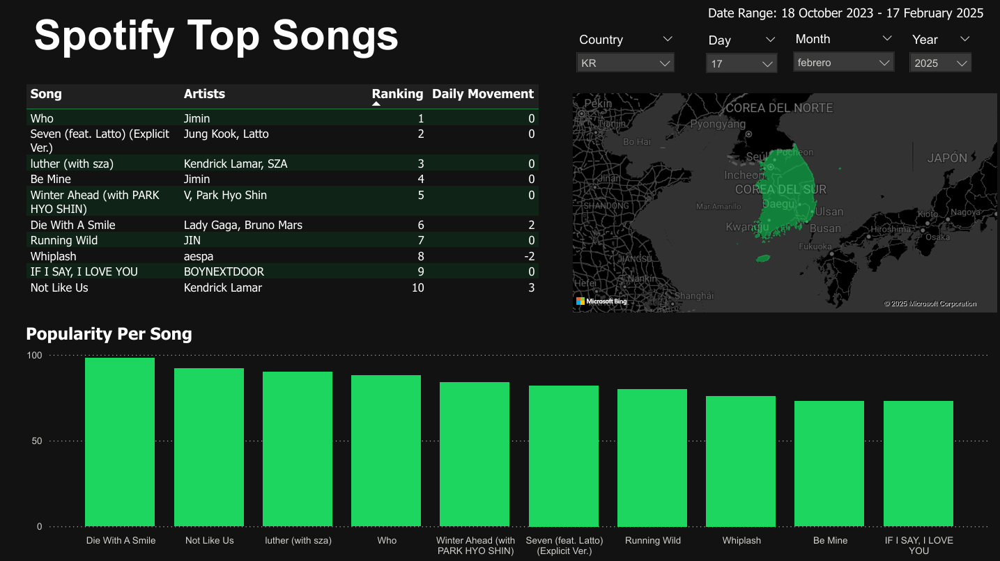

# [Spotify-Songs](#content-table)
The propose of this project is to strengthen my SQL skills and practice with PowerBI.

# [Content Table](#content-table)

- [Spotify-Songs](#spotify-songs)
- [Content Table](#content-table)
- [Introduction](#introduction)
  - [Data Description](#data-description)
- [Procedure](#procedure)
  - [Data Exploration](#data-exploration)
  - [Data Cleaning](#data-cleaning)
  - [Dashboard Creation](#dashboard-creation)
    - [Link to Dashboard](#link-to-dashboard)

# [Introduction](#content-table)

For this project, we're going to make a Power BI dashboard. The dashboard will show the most popular songs on Spotify in each country. To develop this project, we're going to upload the dataset to a PostgreSQL database.

## [Data Description](#content-table)

The data proportioned has the following columns of data: 

* `spotify_id`: Unique identifier for the song in Spotify
* `name`: The title of the song
* `artist`: Name(s) of the artist(s) associated with the song
* `daily_rank`: Daily rank of the song in the top 50 list (0 to 50)
* `daily_movement`: Change in rankings compared to the previous day (-49 to 50)
* `weekly_movement`: Change in rankings compared to the previous week (-49 to 50) 
* `country`: ISO code of the country of the TOP 50 Playlist
* `snapshot_date`: Date on which the data was collected from Spotify 
* `popularity`: Measure of the song's current popularity on Spotify (0 to 100)
* `is_explicit`: Whether the song contains explicit lyrics
* `duration_ms`: The duration of the song in milliseconds 
* `album_name`: Name of the album of the song
* `album_release_date`: Date of the release of the album of the song
* `danceability`
* `energy`
* `key`
* `loudness`
* `mode`
* `speechiness`
* `acousticness`
* `instrumentalness`
* `liveness`
* `valence`
* `tempo`
* `time_signature`

# [Procedure](#content-table)

We are going to segment this project in different sections:

* Data Exploration
* Data Cleaning
* Dashboard Creation

## [Data Exploration](#content-table)

In this section we loaded the data to a database in PostgreSQL, also we connected the database using Python and we explore the data for errors and anomalies.

When we loaded our data to PostgreSQL, we assign the following type to each column: 

  * spotify_id: Character(30)
  * name: Text
  * artist: Text
  * daily_rank: Integer
  * daily_movement: Integer
  * weekly_movement: Integer
  * country: Character(10)
  * snapshot_date: Date
  * popularity: Integer
  * is_explicit: Boolean
  * duration_ms: Integer
  * album_name: Text
  * album_release_date: Date
  * danceability: Double Precision
  * energy: Double Precision
  * key: Integer
  * loudness: Double Precision
  * mode: Integer
  * speechiness: Double Precision
  * acousticness: Double Precision
  * instrumentalness: Double Precision
  * liveness: Double Precision
  * valence: Double Precision
  * tempo: Double Precision
  * time_signature: Double Precision
  
We couldn't assign the date type to the column `album_release_date` because it have empty rows. Reviewing the empty rows of the column `album_release_date` we find that the columns `name`, `artists`, `album_name` and `country` have also empty rows.

## [Data Cleaning](#content-table)

In the Data Cleaning section we process those issues of the database, first of all we change the empty spaces of the columns `album_release_date`, `name`, `artists` and `album_name` for Null:

```sql
-- Replacing "" for NULL
UPDATE spotify_top_songs
SET 
    "name" = CASE WHEN "name" = '' THEN NULL ELSE "name" END,
    artists = CASE WHEN artists = '' THEN NULL ELSE artists END,
    album_name = CASE WHEN album_name = '' THEN NULL ELSE album_name END,
    album_release_date = CASE WHEN album_release_date = '' THEN NULL ELSE album_release_date END;
```

Then, we find that the empty rows of the columns `name` and `artists` are the same 30 rows and it only represents the 0.0017% of all our data, so we get rid of them with the following query: 

```sql
DELETE FROM spotify_top_songs
WHERE
    "name" IS NULL OR
    artists IS NULL;
```

Then, after an investigation, we find that the songs that have missing `album_release_date` and `album_name` are: 

  * Silent Night - 1999 Remaster
  * Mistletoe And Holly - Remastered 1999
  * Jingle Bells - Remastered 1999
  * Have Yourself A Merry Little Christmas - Remastered
  * Brown Eyed Girl
  * ABCD

In which they belong to the following information: 

* Silent Night - 1999 Remaster
* Mistletoe And Holly - Remastered 1999
* Jingle Bells - Remastered 1999
* Have Yourself A Merry Little Christmas - Remastered

Belongs to the same album "A Jolly Christmas from Frank Sinatra" and is released on "September 21 of 1957".

For the song: 

* Brown Eyed Girl

It belong to the album "Blowin' Your Mind!" and is released on "September 01 of 1967".

And lastly for the song: 

* ABCD

It belongs to the album "Na".

Having this information we updated our database with the following query: 

```sql
UPDATE  spotify_top_songs
SET
    album_name = CASE 
        WHEN artists = 'Frank Sinatra' AND album_name IS NULL THEN 'A Jolly Christmas from Frank Sinatra' 
        WHEN artists = 'Van Morrison' AND album_name IS NULL THEN 'Blowin'' Your Mind!'
        WHEN artists = 'NAYEON' AND album_name IS NULL THEN 'Na' 
        ELSE album_name
    END,
    album_release_date = CASE 
        WHEN artists = 'Frank Sinatra' AND album_release_date IS NULL THEN '1957-09-21'
        WHEN artists = 'Van Morrison' AND album_release_date IS NULL THEN '1967-09-01' 
        ELSE album_release_date 
    END;
```

And lastly, we fill the empty rows of the column `country` with the value "Unknown" with the next query: 

```sql
UPDATE spotify_top_songs
SET
    country = CASE WHEN country = '' THEN 'Unknown' ELSE country END;
```

Once our data is clean, we prosed with the next step of the project.

## [Dashboard Creation](#content-table)

For our dashboard we are going to show the top 10 songs for a specific country (of course you could filter the country), the dashboard will show the popularity of those top 10 and the daily movement that the songs have, leaving us with the following result:



You can download the dashboard created for this project in the following link: 

### [Link to Dashboard](Dashboard.pbix)
